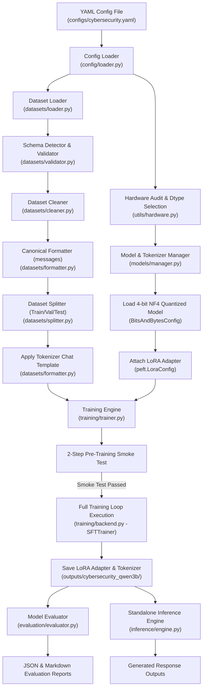

# UNIVERSAL QLORA FINE-TUNER
## Complete Architecture, Workflow & Code Explanation Guide

---

## 1. PROJECT OVERVIEW & GOALS

The **Universal QLoRA Fine-Tuner** is a production-quality, modular, hardware-adaptive Python package designed to fine-tune Large Language Models (LLMs) efficiently on consumer or single enterprise GPUs (such as NVIDIA Tesla T4 16GB) using 4-bit quantization and Low-Rank Adaptation (LoRA).

### Key Architectural Principles
1. **Universal Reusability**: Not hardcoded for one specific dataset or model architecture. Works seamlessly with any model (e.g. Qwen, Llama, Mistral, Gemma) and dataset schema (`messages`, `instruction`/`answer`, `question`/`answer`, `prompt`/`response`, `text`).
2. **Single Source of Truth**: Full Python package structure (`src/qlora_engine`) tracked in Git repository (`https://github.com/Sujan833/QLORA.git`). Notebooks call execution scripts directly.
3. **Hardware Adaptive**: Detects GPU compute capability automatically (e.g. Turing Tesla T4 uses `float16`; Ampere A100/H100 uses `bfloat16`).
4. **Resilient & Backward Compatible**: Uses Python dynamic signature inspection (`inspect.signature`) to support any version of Hugging Face `transformers`, `peft`, and `trl` (TRL 0.8.x through 0.15+).
5. **Single-GPU Enforced**: Prevents `torch.nn.DataParallel` multi-threaded replication bugs on 4-bit `bitsandbytes` quantized models.

---

## 2. PROJECT DIRECTORY STRUCTURE

```text
QLORA/
├── configs/
│   ├── cybersecurity.yaml       # Primary configuration file for Cybersecurity dataset & Qwen2.5-3B
│   └── example.yaml             # Example template for custom datasets/models
├── notebooks/
│   └── kaggle_qlora.ipynb       # 1-click execution notebook for Kaggle environment
├── requirements/
│   └── kaggle.txt               # PyPI dependencies pinned for Kaggle environment
├── scripts/
│   ├── prepare_dataset.py       # Standalone dataset preparation script
│   ├── validate_dataset.py      # Standalone dataset audit & validation script
│   ├── train.py                 # End-to-end QLoRA training script
│   ├── evaluate.py              # Test set evaluation & report generation script
│   └── inference.py             # Interactive inference script for fine-tuned adapter
├── src/
│   └── qlora_engine/
│       ├── __init__.py          # Package init & torchvision mock guard & single GPU default
│       ├── config/
│       │   └── loader.py        # YAML config loader & validator
│       ├── datasets/
│       │   ├── analyzer.py      # Token length analysis & distribution stats
│       │   ├── cleaner.py       # Deduplication, trimming, and null filtering
│       │   ├── formatter.py     # Schema auto-detection & canonical messages converter
│       │   ├── loader.py        # Hugging Face dataset downloader/loader
│       │   ├── splitter.py      # Train / Validation / Test splitter
│       │   └── validator.py     # Dataset structure & anomaly validator
│       ├── evaluation/
│       │   └── evaluator.py     # Test set generation evaluator & report builder
│       ├── inference/
│       │   └── engine.py        # Standalone inference engine with reloaded adapters
│       ├── models/
│       │   └── manager.py       # 4-bit BNB quantization & LoRA adapter manager
│       ├── training/
│       │   ├── backend.py       # SFTTrainer backend with dynamic signature inspection
│       │   └── trainer.py       # Trainer manager, 2-step smoke test & training loop
│       └── utils/
│           ├── hardware.py      # CUDA environment audit & compute dtype selector
│           ├── logging.py       # Structured logging system
│           └── metadata.py      # Hardware & execution metadata exporter
├── tests/
│   ├── conftest.py              # Pytest fixtures and mock setup
│   ├── test_config.py           # Unit tests for config loading
│   ├── test_dataset.py          # Unit tests for dataset operations
│   ├── test_formatter.py        # Unit tests for schema formatting
│   ├── test_model.py            # Unit tests for model loading & quantization
│   └── test_training.py         # Integration tests for training execution
├── .gitignore                   # Ignore checkpoints, cache, artifacts, & venv
├── pyproject.toml               # Modern Python project configuration
├── PROJECT_DOCUMENTATION.md    # Complete architectural & line-by-line guide
└── README.md                    # Project documentation & usage instructions
```

---

## 3. END-TO-END PIPELINE WORKFLOW



---

## 4. DETAILED CODE BREAKDOWN & EXPLANATION BY MODULE

### A. Core Package Guard & Environment (`src/qlora_engine/__init__.py`)
* **`os.environ.setdefault("CUDA_VISIBLE_DEVICES", "0")`**: Forces PyTorch to see only 1 GPU (`cuda:0`). This eliminates multi-threaded `DataParallel` replication errors on 4-bit quantized models in dual-GPU Kaggle environments.
* **`DummyMeta` & `torchvision` Mock**: Kaggle environment has a broken pre-installed `torchvision` binary extension that fails when Hugging Face `transformers` statically imports vision utilities. This dynamic metaclass interceptor mocks `torchvision` so `transformers` imports cleanly without throwing C++ `torchvision::nms` symbol errors.

---

### B. Hardware Audit & Compute Dtype Selection (`src/qlora_engine/utils/hardware.py`)
* **`detect_hardware()`**: Inspects PyTorch CUDA environment, GPU device name, total/free VRAM, compute capability, and selects the optimal compute dtype.
* **`get_optimal_compute_dtype(major_cc)`**:
  * **Turing GPUs (Compute Capability < 8.0, e.g., Tesla T4 cc 7.5)**: Native `bfloat16` is unsupported in cuBLAS for matrix multiplication. Automatically selects `torch.float16` to prevent `CUBLAS_STATUS_EXECUTION_FAILED`.
  * **Ampere/Hopper GPUs (Compute Capability >= 8.0, e.g., A100, H100, RTX 3090/4090)**: Selects `torch.bfloat16` for optimal precision and performance.

---

### C. Universal Dataset Pipeline (`src/qlora_engine/datasets/`)

1. **`loader.py` (`DatasetLoader`)**:
   * Downloads or loads datasets from Hugging Face Hub or local disk (JSON, CSV, Parquet).
2. **`formatter.py` (`DatasetFormatter`)**:
   * **`detect_schema(dataset)`**: Automatically identifies column structures (`messages`, `instruction`+`answer`, `question`+`answer`, `prompt`+`response`, `text`).
   * **`format_to_canonical(dataset, schema)`**: Maps records into standard OpenAI/HuggingFace `messages` format:
     `[{"role": "user", "content": "..."}, {"role": "assistant", "content": "..."}]`.
   * **`apply_chat_template(dataset, tokenizer)`**: Formats message arrays into full text strings using the tokenizer's official Jinja chat template.
3. **`cleaner.py` (`DatasetCleaner`)**:
   * Removes duplicate rows, trims leading/trailing whitespace, drops empty/null prompts, and filters records exceeding maximum sequence lengths.
4. **`splitter.py` (`DatasetSplitter`)**:
   * Splits the canonical dataset into reproducible `train`, `validation`, and `test` splits based on configured ratios (default 90% train, 5% validation, 5% test).
5. **`analyzer.py` (`TokenAnalyzer`)**:
   * Calculates token length statistics (min, max, mean, 90th/95th/99th percentiles) across dataset samples to guide sequence length selection.

---

### D. Model Loading, Quantization & LoRA Attachment (`src/qlora_engine/models/manager.py`)

1. **`load_tokenizer()`**:
   * Loads `AutoTokenizer` from pretrained path.
   * Sets `padding_side = "right"` (required for causal decoder-only auto-regressive generation and training).
   * Sets `tokenizer.pad_token = tokenizer.eos_token` if `pad_token` is missing.
2. **`load_model()`**:
   * Instantiates 4-bit NF4 quantization config using `BitsAndBytesConfig`:
     * `load_in_4bit = True`
     * `bnb_4bit_quant_type = "nf4"` (NormalFloat4)
     * `bnb_4bit_use_double_quant = True` (Quantizes quantization constants, saving extra VRAM)
     * `bnb_4bit_compute_dtype = optimal_dtype` (`float16` on T4)
   * Loads model with `device_map = {"": 0}` (single-GPU placement).
   * Executes `model = prepare_model_for_kbit_training(model)` (freezes base weights, converts layer norms to float32).
   * Explicitly sets `model.config.use_cache = False` to ensure compatibility with gradient checkpointing.
3. **`attach_lora(model)`**:
   * Configures `LoraConfig`:
     * `r = 16` (Rank of low-rank update matrices)
     * `lora_alpha = 32` (Scaling factor)
     * `lora_dropout = 0.0`
     * `target_modules = ["q_proj", "k_proj", "v_proj", "o_proj", "gate_proj", "up_proj", "down_proj"]`
   * Attaches LoRA adapters using `get_peft_model(model, peft_config)`.
   * Audits trainable parameters and prints summary (e.g. ~0.43% parameters trainable).

---

### E. Training Backend & Execution (`src/qlora_engine/training/`)

1. **`backend.py` (`instantiate_sft_trainer`)**:
   * **Dynamic Parameter Inspection (`inspect.signature`)**: Inspects `SFTConfig.__init__` and `TrainingArguments.__init__` at runtime to pass **only** arguments supported by the installed `trl`/`transformers` version.
   * **Single GPU Override (`args._n_gpu = 1`)**: Explicitly overrides `_n_gpu` on `args` to prevent `SFTTrainer` from attempting `DataParallel` in multi-GPU environments.
   * Instantiates `SFTTrainer` with multi-tiered kwarg fallbacks (`processing_class` vs `tokenizer`, `dataset_text_field`, `max_seq_length`, `packing`).
2. **`trainer.py` (`QLoraTrainer`)**:
   * **Pre-Training Safety Audit**: Verifies model device placement, non-zero trainable parameters, and dataset split validity.
   * **2-Step Smoke Test (`run_smoke_test`)**: Executes a fast 2-step training run on a small sample subset before starting full training. Catches OOM, gradient flow, and parameter mismatch bugs in under 30 seconds.
   * **Full Training Loop (`train`)**: Executes full fine-tuning loop and saves adapter weights + tokenizer to `outputs/cybersecurity_qwen3b/`.

---

### F. Post-Training Evaluation & Inference (`src/qlora_engine/`)

1. **`evaluation/evaluator.py` (`ModelEvaluator`)**:
   * Runs model generation on held-out test split records.
   * Produces structured JSON (`evaluation_report.json`) and Markdown (`evaluation_report.md`) reports containing qualitative side-by-side prompt vs reference vs generated output comparisons.
2. **`inference/engine.py` (`InferenceEngine`)**:
   * Standalone inference engine capable of reloading the base model in 4-bit NF4 precision and attaching saved LoRA adapter weights.
   * Supports formatted chat message generation using `tokenizer.apply_chat_template` and nucleus sampling (`temperature`, `top_p`, `max_new_tokens`).

---

## 5. SUMMARY OF KEY BUGS SOLVED DURING DEVELOPMENT

| Bug / Failure Symptom | Underlying Cause | Engineering Fix Applied |
| :--- | :--- | :--- |
| **`CUBLAS_STATUS_EXECUTION_FAILED` on Tesla T4** | Turing architecture (cc 7.5) does not support native `bfloat16` cuBLAS operations. | `hardware.py` dynamically inspects CUDA compute capability and forces `float16` for cc < 8.0. |
| **`RuntimeError: operator torchvision::nms does not exist`** | Kaggle's pre-installed `torchvision` binary extension mismatched `torch`. | `src/qlora_engine/__init__.py` injects a dynamic `DummyMeta` module mock intercepting all `torchvision` symbol accesses. |
| **`TypeError: SFTConfig got unexpected keyword argument 'dataset_text_field'`** | TRL 0.12+ removed/deprecated direct `dataset_text_field` kwargs in some signatures. | `backend.py` uses `inspect.signature` to dynamically filter supported kwargs across any TRL version (0.8 through 0.15+). |
| **`RuntimeError: Caught RuntimeError in replica 0 on device 0` (`CUBLAS_STATUS_NOT_SUPPORTED`)** | Kaggle dual-GPU (T4 x 2) triggered `torch.nn.DataParallel`, which cannot replicate 4-bit `bitsandbytes` modules. | Set `CUDA_VISIBLE_DEVICES="0"` in `__init__.py` and `train.py`, set `args._n_gpu = 1`, and set `model.config.use_cache = False`. |
| **`ImportError: bitsandbytes>=0.46.1 required`** | Latest Hugging Face `transformers` requires `bitsandbytes>=0.46.1` for 4-bit quantization. | Updated `requirements/kaggle.txt` to pin `bitsandbytes>=0.46.1`. |

---

## 6. HOW TO RUN THE PROJECT ON KAGGLE

### 1-Click Execution Command
```bash
!git clone https://github.com/Sujan833/QLORA.git /kaggle/working/QLORA
!pip install -r /kaggle/working/QLORA/requirements/kaggle.txt
!python /kaggle/working/QLORA/scripts/train.py --config /kaggle/working/QLORA/configs/cybersecurity.yaml
```

### Post-Training Evaluation & Inference
```bash
# Run test set evaluation
!python /kaggle/working/QLORA/scripts/evaluate.py --config /kaggle/working/QLORA/configs/cybersecurity.yaml --samples 10

# Run interactive inference
!python /kaggle/working/QLORA/scripts/inference.py --config /kaggle/working/QLORA/configs/cybersecurity.yaml --prompt "Explain SQL injection vulnerabilities and how to mitigate them."
```
