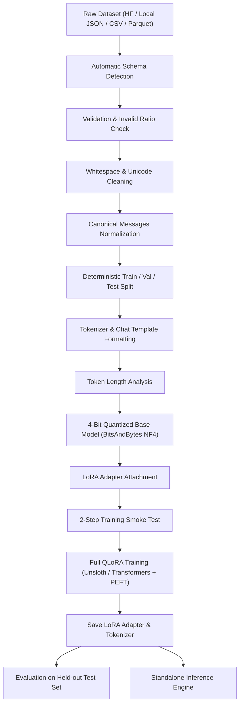

# Universal QLoRA Fine-Tuner

A production-grade, modular, and reusable LLM fine-tuning engine optimized for **QLoRA (4-bit quantization + LoRA)** on single-GPU hardware (e.g., NVIDIA Tesla T4 in Kaggle) as well as larger GPUs.

---

## 📌 Features

- **Universal Dataset Ingestion**: Supports Hugging Face Datasets, JSON, JSONL, CSV, and Parquet.
- **Automatic Schema Detection & Canonical Normalization**: Automatically converts input datasets (`instruction`/`answer`, `question`/`answer`, `prompt`/`response`, `messages`, `text`) into canonical chat messages format (`[{"role": "user", "content": "..."}, {"role": "assistant", "content": "..."}]`).
- **Data Validation & Cleaning**: Validates record structure, computes invalid ratios against thresholds, removes exact duplicates, and normalizes whitespace/Unicode without mutating raw data.
- **Robust Hardware Detection & Compute Dtype Selection**: Automatically detects GPU compute capability. Defaults to `float16` for NVIDIA Turing GPUs (Tesla T4) to fix `CUBLAS_STATUS_EXECUTION_FAILED` runtime errors, and `bfloat16` for Ampere/Hopper GPUs.
- **Single GPU Enforcement**: Disables multi-GPU `DataParallel` wrappers and multi-replica IPC bugs by pinning device placement cleanly to GPU 0 (`device_map={"": 0}`).
- **Dual Training Backends**: Supports **Unsloth** optimized backend with automatic fallback to **Hugging Face Transformers + PEFT + TRL (`SFTTrainer`)**.
- **Pre-Training Safety Audit & Smoke Test**: Runs a conservative 2-step training smoke test on a tiny sample subset before committing to full training.
- **Independent Inference & Evaluation**: Standalone inference engine capable of reloading base models and adapters after session restarts, alongside automated test-set evaluation reporting.

---

## 🏗️ Architecture Pipeline



---

## 📂 Repository Structure

```
Universal-QLoRA-FineTuner/
├── configs/
│   ├── cybersecurity.yaml
│   └── example.yaml
├── src/
│   └── qlora_engine/
│       ├── __init__.py
│       ├── config/
│       │   ├── __init__.py
│       │   └── loader.py
│       ├── datasets/
│       │   ├── __init__.py
│       │   ├── loader.py
│       │   ├── validator.py
│       │   ├── formatter.py
│       │   ├── cleaner.py
│       │   ├── splitter.py
│       │   └── analyzer.py
│       ├── models/
│       │   ├── __init__.py
│       │   └── manager.py
│       ├── training/
│       │   ├── __init__.py
│       │   ├── backend.py
│       │   └── trainer.py
│       ├── evaluation/
│       │   ├── __init__.py
│       │   └── evaluator.py
│       ├── checkpointing/
│       │   ├── __init__.py
│       │   └── manager.py
│       ├── inference/
│       │   ├── __init__.py
│       │   └── engine.py
│       └── utils/
│           ├── __init__.py
│           ├── hardware.py
│           ├── logging.py
│           └── metadata.py
├── scripts/
│   ├── prepare_dataset.py
│   ├── validate_dataset.py
│   ├── train.py
│   ├── evaluate.py
│   └── inference.py
├── notebooks/
│   └── kaggle_qlora.ipynb
├── tests/
│   ├── test_config.py
│   ├── test_dataset.py
│   ├── test_formatter.py
│   ├── test_model.py
│   └── test_training.py
├── requirements/
│   └── kaggle.txt
├── .gitignore
├── README.md
└── pyproject.toml
```

---

## 🚀 Quick Start & Installation

### 1. Local / Development Setup

```bash
# Clone the repository
git clone https://github.com/your-username/Universal-QLoRA-FineTuner.git
cd Universal-QLoRA-FineTuner

# Install package and dependencies
pip install -e .
```

### 2. Running Unit Tests

```bash
pytest tests/
```

### 3. Static Verification

```bash
python -m compileall src scripts tests
```

---

## ⚙️ Configuration Guide

Configurations are defined using YAML in `configs/`.

```yaml
project:
  name: Universal-QLoRA-FineTuner
  experiment_name: cybersecurity_qwen3b

model:
  name: Qwen/Qwen2.5-3B-Instruct
  quantization:
    enabled: true
    load_in_4bit: true
    quant_type: nf4
    double_quantization: true
    compute_dtype: auto

dataset:
  source: huggingface
  name: Tiamz/cybersecurity-instruction-dataset
  split: train
  validation:
    max_invalid_ratio: 0.10
  cleaning:
    enabled: true
    trim_whitespace: true
    normalize_whitespace: true
    normalize_unicode: true
    remove_exact_duplicates: true

split:
  train: 0.90
  validation: 0.05
  test: 0.05
  seed: 3407

lora:
  r: 16
  alpha: 32
  dropout: 0.0
  target_modules:
    - q_proj
    - k_proj
    - v_proj
    - o_proj
    - gate_proj
    - up_proj
    - down_proj

training:
  backend: auto
  epochs: 2
  batch_size: 1
  gradient_accumulation_steps: 8
  learning_rate: 0.0002
  max_seq_length: 1024
  gradient_checkpointing: true
  optimizer: adamw_8bit
  single_gpu: true
```

---

## 🛠️ Command-Line Scripts Usage

### Validate Dataset
```bash
python scripts/validate_dataset.py --config configs/cybersecurity.yaml
```

### Prepare Dataset & Splits
```bash
python scripts/prepare_dataset.py --config configs/cybersecurity.yaml
```

### Run Full Fine-Tuning Pipeline
```bash
python scripts/train.py --config configs/cybersecurity.yaml
```

### Evaluate Fine-Tuned Model
```bash
python scripts/evaluate.py --config configs/cybersecurity.yaml --samples 10
```

### Generate Responses via Inference Engine
```bash
python scripts/inference.py --config configs/cybersecurity.yaml --prompt "What is SQL injection?"
```

---

## 📓 Kaggle Execution Guide

1. Open a new Kaggle Notebook with **GPU P100** or **GPU T4 x1** accelerator.
2. Open `notebooks/kaggle_qlora.ipynb`.
3. Run cells sequentially to execute hardware audit, dataset preparation, 4-bit loading, smoke testing, training, evaluation, and adapter reload.

---

## 💡 Troubleshooting & Tesla T4 Fixes

- **`CUBLAS_STATUS_EXECUTION_FAILED`**: Caused by forcing `bfloat16` compute dtype on NVIDIA Tesla T4 (compute capability 7.5). The engine automatically selects `float16` for Turing GPUs, resolving this error.
- **`DataParallel` Multi-GPU Conflicts**: Quantized `bitsandbytes` models do not support PyTorch `DataParallel`. The engine enforces `device_map={"": 0}` and disables `DataParallel` by default.
- **Missing `Counter` or Symbol Imports**: All modules explicitly import standard library utilities.

---

## 📄 License
MIT License.
